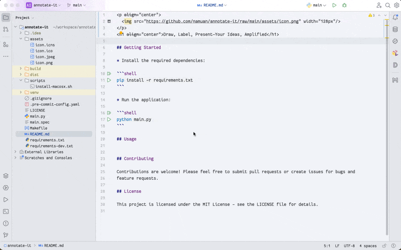

  

<h1 style="text-align: center;">Draw, Label, Present—Your Ideas, Amplified</h1>

## Multiple Monitor Support

Annotate-It now supports multiple monitor setups! When you have more than one monitor connected, the application will automatically detect all available displays and show a monitor selection dialog at startup.

## Supported annotations

* **Line**: Draw straight lines on the screen.
* **Arrow**: Draw arrows with customizable direction and color.
* **Rectangle**: Draw rectangular shapes, with an option to fill.
* **Ellipse**: Draw elliptical shapes, with an option to fill.
* **Text**: Add text annotations at specific positions.

The application also supports the following methods to track or highlight the cursor:

* **Halo Effect**: Displays a radial gradient circle around the cursor, using the current shape's color with adjustable opacity. Toggled with the 'H' key.
* **Flashlight Effect**: Creates a glowing circular effect around the cursor with a yellow gradient, simulating a flashlight. Toggled with the 'Shift+F' key.
* **Mouse Mask Effect**: Applies a semi-transparent overlay across the screen, with a clear circular area around the cursor to highlight it. Toggled with the 'M' key.
* **Magnifier Effect**: Shows a circular magnified view of the screen content below the cursor with 2x zoom factor and configurable window sizes: current size, 2x bigger, and 4x bigger (macOS only, requires Screen Recording permission). Toggled with the 'Z' key, window size cycled with 'Shift+Z'.

## Floating Menu

Annotate-It features an optional floating menu that provides visual access to all annotation tools and effects. The floating menu:

* **Visual Tool Selection**: Click on tool buttons (L, A, R, E, T) to switch between Line, Arrow, Rectangle, Ellipse, and Text tools
* **Effect Toggles**: Click on effect buttons (H, F, M, Z) to toggle Halo, Flashlight, Mouse Mask, and Magnifier effects
* **Utility Functions**: Access Fill toggle (F), Opacity cycling (O), Clear all (C), Export (X), and Configuration (⚙) functions
* **Visual State Indicators**: Active tools and effects are highlighted with different colors (blue for tools, orange for effects, green for utilities)
* **Hover Tooltips**: Each button shows the corresponding keyboard shortcut when hovered
* **Smooth Animations**: Fade-in/fade-out animations for better user experience
* **Multi-Monitor Support**: Automatically positions on the correct monitor in multi-monitor setups
* **Configurable**: Can be enabled/disabled through the configuration system

The floating menu appears at the top center of the screen and can be toggled with the `Tab` key. It maintains all existing keyboard shortcuts, so you can use either the floating menu or keyboard shortcuts based on your preference.

## Usage

The app works with keyboard shortcuts.
Press `Cmd+,` (or `Ctrl+,` on Windows/Linux) to quickly view all shortcuts.

### Keyboard Shortcuts

- `A/a`: Switch to arrow drawing mode
- `R/r`: Switch to rectangle drawing mode
- `E/e`: Switch to ellipse drawing mode
- `T/t`: Switch to text input mode
- `L/l`: Switch to line drawing mode
- `F/f`: Toggle filled shapes on/off
- `O/o`: Cycle through opacity levels (100% → 50% → 25%)
- `H/h`: Toggle halo effect on/off
- `M/m`: Toggle mouse mask effect on/off
- `Shift+F`: Toggle flashlight effect on/off
- `Z/z`: Toggle magnifier effect on/off (macOS only)
- `Shift+Z`: Cycle magnifier window size (current → 2x bigger → 4x bigger) (macOS only)
- `C/c`: Clear all drawings
- `X/x`: Export drawing to clipboard as image
- `Q/q`: Quit the application
- `Ctrl+Z`: Undo last action
- `Ctrl+Y`: Redo last undone action
- `Ctrl+,`: Open configuration dialog
- `Tab`: Toggle floating menu visibility

## Configuration

Press `Cmd+,` (or `Ctrl+,` on Windows/Linux) to open the configuration dialog. This dialog allows you to:

- View all keyboard shortcuts
- Customize colors for different drawing tools:
    - Arrow color
    - Rectangle color
    - Ellipse color
    - Text color
    - Line color

Changes to colors are applied immediately after closing the configuration dialog.

## Getting Started

Download this repo (either clone it or download the zip file)

Run the `install.command` script to install this application.

After installation, you can run the application from the $USER/Applications folder.

## Contributing

Contributions are welcome! Please feel free to submit pull requests or create issues for bugs and
feature requests.

## License

This project is licensed under the MIT License - see the LICENSE file for details.
